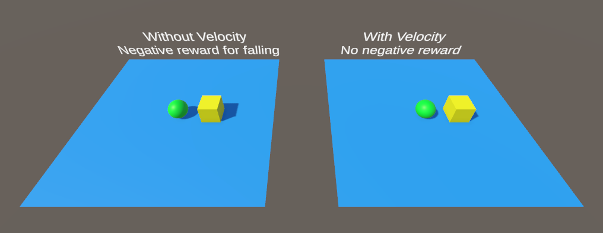
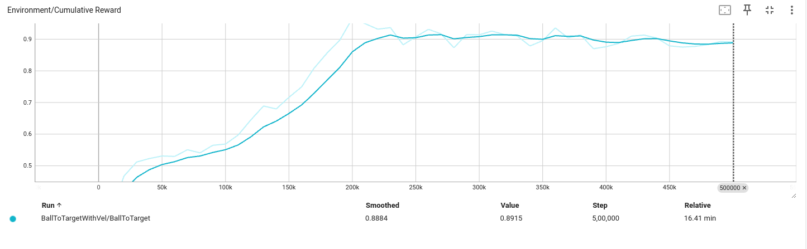
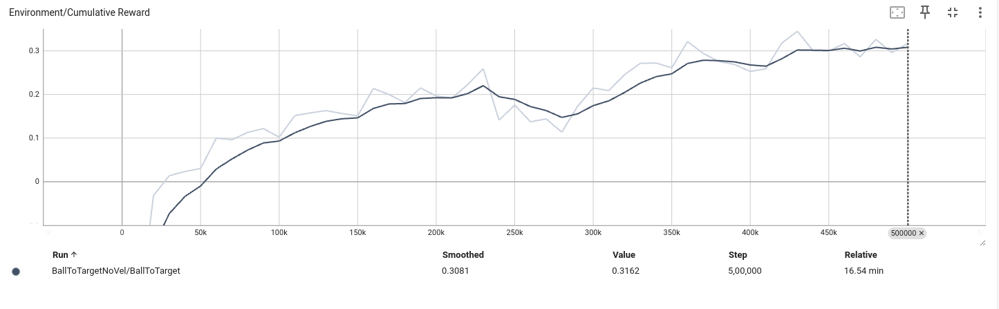

# Training Roller Ball
   
## Setup
- Scenes :
  - Roller ball Testing : Here we have both the trained models in inference mode.
  
  - Roller ball Training : Here we have training setup for roller ball with velocity observation and no negative reward for falling.
  - Roller ball Testing no vel : Here we have training setup for roller ball without velocity observation and negative reward for falling.
- Scripts :
  - BallAgent : this is the agent script for training roller ball with velocity observation and no negative reward for falling.
  - BallAgentNoVel : this is the agent script for training roller ball without velocity observation and negative reward for falling.
- Prefabs : contains training and inference environment for both models.

## Cumulative Reward Plot
With Velocity

Without Velocity

## Observations
- the model with velocity observation was able to learn much better than the model without velocity observation. but as it didn't have any negative reward for falling, it didn't learn to avoid falling which was learned well in case of model with velocity.
- the model with velocity observation have more controlled motion avoiding falling and always moving towards target optimally, whereas second model is reckless and don't always prioritize moving towards target.